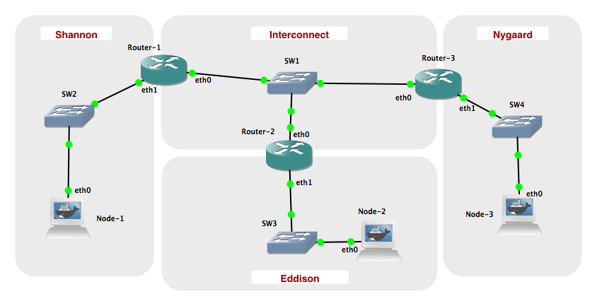
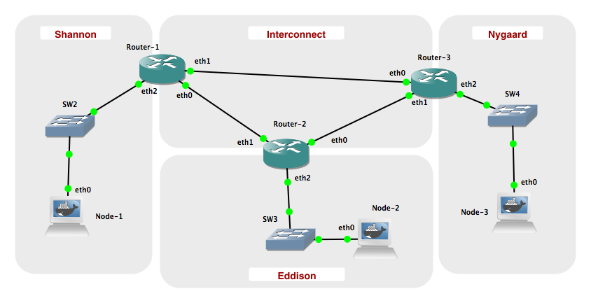

# Workshop 4: Dynamic Routing Part I

[ [Back to Root page](https://github.com/rhjacobsen/CN_workshops/blob/master/README.md) ]

## IP Routing

This workshop consists of two parts. The first part shows how routing can be setup statically in an IP network, while the second part uses the RIP protocol to perform dynamic routing. We will only be using IPv4 in this workshop as the IPv4 addresses are shorter and hence easier to deal with. The basic concepts are the same for IPv6 networks.

### Lab Overview

#### Topology



#### Networks

| Name         | Network
|--------------|--------------------------
| Interconnect | 192.168.0.0 / 24
| Shannon      | 192.168.1.0 / 24
| Edison       | 192.168.2.0 / 24
| Nygaard      | 192.168.3.0 / 24

### Setting up the Laboratory

The network nodes in the laboratory are to be configured with static IPv4 addresses that are retained between laboratory restarts as explained in the following.

* Start GNS3.
* Build the laboratory depicted above.

#### IP Allocation

| Node      |	Eth0 	           | Eth1
|-----------|------------------|-------------
| Node 1	  | 192.168.1.2 / 24 | N/A
| Node 2	  | 192.168.2.2 / 24 | N/A
| Node 3	  | 192.168.3.2 / 24 | N/A
| Router 1	| 192.168.0.1 / 24 | 192.168.1.1 / 24
| Router 2	| 192.168.0.2 / 24 | 192.168.2.1 / 24
| Router 3	| 192.168.0.3 / 24 | 192.168.3.1 / 24

You can create _persistent_ network configuration by right-clicking a node, choosing _Configure_ and click the _Edit_ button.

This would be the text for Node 1

```
auto eth0
iface eth0 inet static
	address 192.168.1.2
	netmask 255.255.255.0
```

Test that "Node 1" can ping eth1 on "Router 1".

On "Node 1" run ```ip route``` this will show the routing table of the host.

> ##### Challenge 4.1
> Use the output from ```ip route``` to explain why "Node 1" cannot ping eth0 of "Router 1".
> ```
>
>
>
>
>
>
> ```


> ##### Challenge 4.2
> Which nodes can ping each other, and which cannot? Explain why this is so (the output of the ```ip route``` command on each node might help you).
> ```
>
>
>
>
>
>
> ```


### Part 1: Static Routing

Having set up the laboratory and seen that the current routing information is not enough, we will add the missing routes manually, such that all nodes can communicate with each other.

On "Node 1" add "Router 1" as default router (gateway) using the following command:

```
ip route add default via 192.168.1.1
```

From "Node 1" ping eth0 of "Router 1" (this should now work).

> ##### Challenge 4.3
> Which IP addresses can "Node 1" reach, i.e., receive a ping-reply from? Explain why.
> ```
>
>
>
>
>
>
> ```


> ##### Challenge 4.4
> For the same reasons as "Node 1" could not ping eth0 of "Router 1" before we added a default route, "Router 1" cannot reach eth1 of "Router 2". Is it reasonable to solve this problem by adding a default gateway?
> ```
>
>
>
>
>
>
> ```

In order for "Router 1" to be able to communicate with eth1 of "Router 2", we need to setup a route to the network 192.168.2.0 / 24. This is done by entering the following on the commandline of "Router 1":

```
ip route add 192.168.2.0/24 via 192.168.0.2
```

This tells the routing system, that network 192.168.2.0 (with netmask 255.255.255.0) is available via the IP address 192.168.0.2.

> ##### Challenge 4.5
> Run the ```ip route``` command on "Router 1", and explain the contents of the routing table.
> ```
>
>
>
>
>
>
> ```

> ##### Challenge 4.6
> What changes are to be made to the routing tables of the remaining network nodes, before all nodes can communicate with each other? Try it out.
> ```
>
>
>
>
>
>
> ```

### Part 2: Dynamic Routing

Having configured routing table entries manually, we now consider dynamic routing. We will use the Quagga routing suite which supports a number of routing protocols.

Quagga consists of a number of daemons. For this workshop we will be using two Quagga daemons: Zebra and Ripd. Zebra is responsible for making changes to the routing table of a node and communicating with the routing protocol daemon. Ripd is a router daemon implementing the RIP protocol.

We have removed the switch and linked the routers directly together. We do this to better show how rip works when one of the links disappear.

#### Topology



#### Networks

| Name           | Network
|----------------|--------------------------
| Shannon        | 192.168.1.0 / 24
| Edison         | 192.168.2.0 / 24
| Nygaard        | 192.168.3.0 / 24
| Interconnect 1 | 192.168.0.0 / 30
| Interconnect 2 | 192.168.0.4 / 30
| Interconnect 3 | 192.168.0.8 / 30


#### IP Allocation

| Node      |	Eth0 	            | Eth1
|-----------|-------------------|-------------
| Node 1	  | 192.168.1.2 / 16  | N/A
| Node 2	  | 192.168.2.2 / 16  | N/A
| Node 3	  | 192.168.3.2 / 16  | N/A
| Router 1	| 192.168.0.1 / 30  | 192.168.0.10 / 30
| Router 2	| 192.168.0.5 / 30  | 192.168.0.2 / 30
| Router 3	| 192.168.0.9 / 30  | 192.168.0.6 / 30

Remember to add the persistent config

### Zebra and Ripd

Next we configure zebra and ripd on "Router 1", such that it both announces routes and accepts routes from the other routers, but not "Node 1" (or generally RIP traffic from "Shannon"):

Create /etc/quagga/daemons, such that it contains:

```
zebra=yes
ripd=yes
```

Create an empty zebra configuration by typing the following on the command line:

```
touch /etc/quagga/zebra.conf
chown quagga:quagga /etc/quagga/zebra.conf
```

The first line creates an empty configuration file, and the second changes the owner to the "quagga" user and the "quagga" group. It is a security requirement that the file exists and is owned by the right user.

Now create the ripd configuration by creating the file /etc/quagga/ripd.conf with the following contents:

```
router rip
network eth0
network eth1

timers basic 30 40 10

redistribute static
redistribute connected

interface eth0
  no ip rip authentication mode

interface eth1
  no ip rip authentication mode
```

The first three lines enable the RIP protocol (router rip), for the two interfaces. "timers basic 30 40 10" changes the default timers of the RIP daemon, so that RIP announcements are send every 30 seconds, routes timeout after 40 seconds, and are removed after 10 seconds (in addition to the 40).

The two "redistribute" lines means that the Quagga service will redistribute both connected routes and static routes using RIP announcements. Static routes are routes created manually, like we did in part 1, while connected routes are routes which are automatically added when assigning IP addresses to interfaces.

The last two lines tell the RIP daemon to accept updates on eth0 and eth1 without authentication. We do not use authentication here, as it will make configuration more difficult without yielding much new information. Also, we only want to receive updates from eth0 and eth1, as "Node 1" should not be able to update routing information on the router.

Change owner on /etc/quagga/ripd.conf using

```
chown quagga:quagga /etc/quagga/ripd.conf
```

Start the daemons by running

```
/usr/sbin/zebra &
/usr/sbin/ripd &
```

Configure the remaining two routers using the previous step as a template. When Quagga has been successfully started on each router, inspect the routing tables using the ```ip route``` command.

Now add the default routes to the 3 nodes.

Ensure that you can ping "Node 2" from "Node 1". If not, there is a problem with the routing tables somewhere in the network.
The program traceroute can be used to find out which paths packets travel in a network. It works by setting the Time-To-Live (TTL) of a test packet to 1, and increasing it by one for each iteration. When a network node receives a packet with a TTL of 1, it responds with an ICMP message (TTL exceeded). Recall, that TTL is decreased by each node when handling it.


> ##### Challenge 4.7
> Run ```traceroute -n 192.168.2.2``` on "Node 1" to find the route packets travel from "Node 1" to "Node 2". Write down the IP addresses and the routers it corresponds to.
> ```
>
>
>
>
>
>
> ```


Packets destined to "Node 2", should go through Router 1 and then Router 2.

* Disable eth1 on Router 2

Inspect the route table at Router 1 over the next 10-30 sec. You should see the route-entry for 192.168.2.0/24 disappear. Now wait another 10-60 sec and the entry should be back.


> ##### Challenge 4.8
> Briefly explain what happens, both when the route is being removed and when it is being established again.
> ```
>
>
>
>
>
>
> ```


> ##### Challenge 4.9
> Run ```traceroute``` again on "Node 1" to find the route. Write it down and briefly explain if it is as expected.
> ```
>
>
>
>
>
>
> ```

Finally, we want to investigate exactly which information is exchanged in the RIP messages.

* Start a capture between Router 1 and Router 3.
* Wait until you can see that a number of RIP messages have been captured by Wireshark, and then stop the capture.
* Inspect these packets.

> ##### Challenge 4.10
> Which routes does Router 3 advertise to Router 1? And what are the metrics?
> ```
>
>
>
>
>
>
> ```

### References

[Quagga suite website](http://www.quagga.net/)
